# Board Assembly

Turning a fabricated BitTag board into a tag ready for deployment: dressing the
board, programming it, attaching and insulating the battery, conformal coating,
and the final check. The procedure below is for BitTag; other families differ
in the programming binary and in case fit, not in the bench work.

!!! note "Source"

    Adapted from *Preparing Bit Tags*, written by the field team in March 2023,
    with revisions through July 2023. It records what was actually done at the
    bench, including the alternatives that were tried and the ones that were
    only suggested. Where a step is marked untested, it has not been through a
    full batch.

## Before you start

The bench needs a temperature-controlled soldering iron with a fine tip, fume
extraction, magnification, and a non-conductive work surface such as a manila
folder or cardboard.

| Item | What was used |
| --- | --- |
| Soldering iron | Hakko FX-951 with a T15 ILS fine-point tip, set to 750 °F |
| Solder | Leaded rosin-core, 24 gauge (0.02–0.025 in) |
| Fume extraction | Xytronic 426DLX, or a fume hood |
| Flux | Kester 952-D6 flux pen |
| Solder wick | Chem-Wik Lite, 0.025 in |
| Flux remover | MG Chemicals flux remover for PC boards |
| Conformal coating | MG Chemicals urethane conformal coating (see the note under [Coating](#5-coat-the-tags)) |
| Insulation | 3 mm Kapton tape, or liquid electrical tape |
| Masking tape | Auto-body masking tape, 3/8 in (1/4 in also works) |
| Tweezers | Ceramic-tipped, to avoid metal-to-metal contact with the board |
| Hanger wire | Green 24-gauge floral wire |

<figure markdown>
  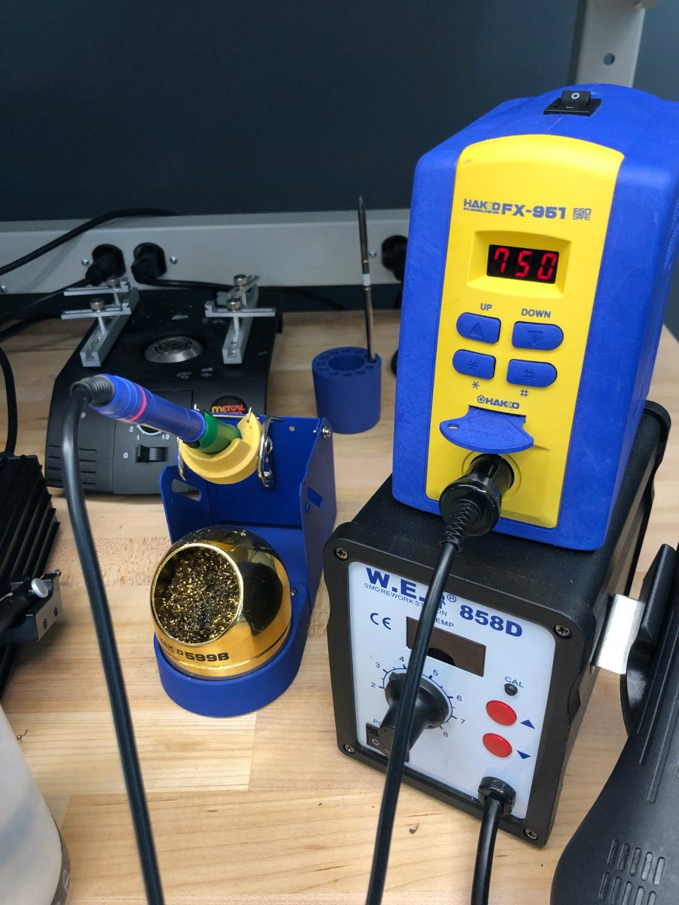
  <figcaption>The soldering station, set to 750 °F.</figcaption>
</figure>

<figure markdown>
  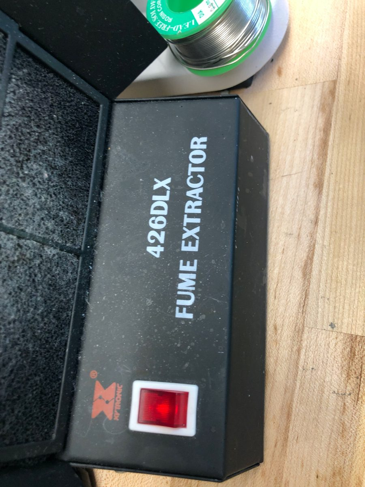
  <figcaption>Fume extraction sits next to the iron, not across the room.</figcaption>
</figure>

<figure markdown>
  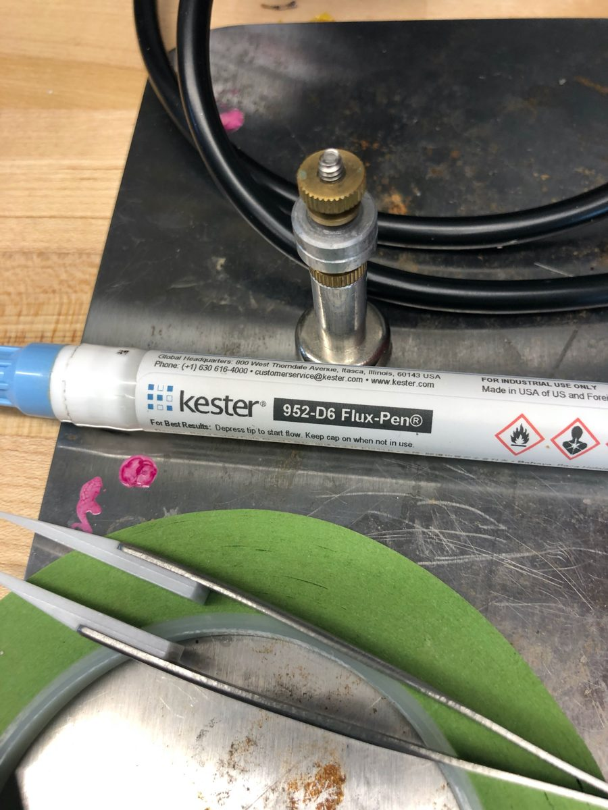
  <figcaption>Flux pen.</figcaption>
</figure>

<figure markdown>
  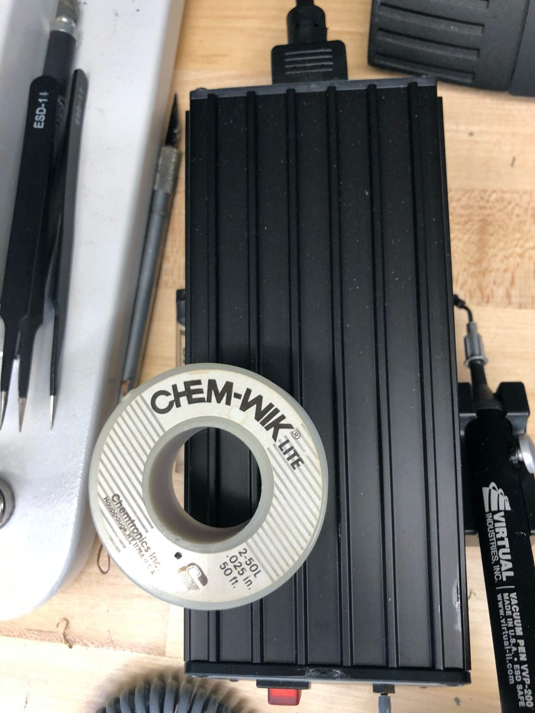
  <figcaption>Solder wick, for lifting excess solder off a contact.</figcaption>
</figure>

<figure markdown>
  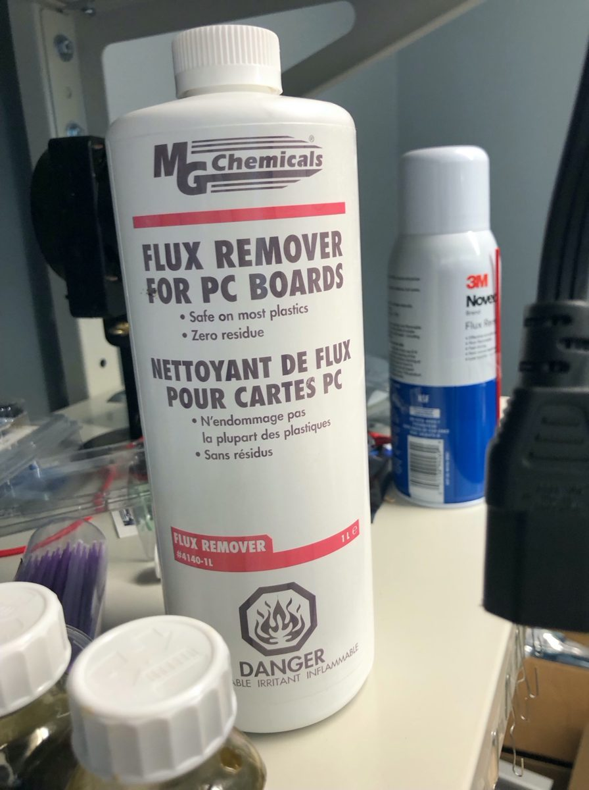
  <figcaption>Flux remover. Keep a working amount in a small jar with a lid.</figcaption>
</figure>

## 1. Dress the board

Boards come back from fabrication with excess fiberglass, often on all four
sides. File it off with a small needle file until each side is flat.

This matters more than it sounds: a board with rough edges will not seat
properly in the programming base.

## 2. Program and test

You will need STM32CubeProgrammer and the BitTag `.elf` binary. Either the
graphical programmer or a shell script works.

1. Put the tag in the programming base.
2. **Graphical:** press **Connect** at the upper right and confirm it reads the
   device successfully. Erase the tag, then download the BitTag `.elf`.
3. **Command line:** run the programming script, correcting the paths to the ST
   programmer and the binary if they do not match your machine.
4. Check that clock drift looks small and that the self-test reports **All
   Passed**.

!!! tip "Expect drift now, not later"

    A fair amount of clock drift at this stage is normal. Drift still present
    at the final check, after coating, is a sign something is wrong with the
    tag rather than with the measurement.

Record the tag's UUID while you have it on the programmer — see
[Record keeping](#7-record-keeping).

## 3. Label

Each tag gets a two-digit alphanumeric code, printed on a label maker (Brother
P-touch) with black type on 9 mm white tape.

- Set the font to 9 pt; Helvetica works.
- Put about three spaces between codes so there is room to cut.
- Underlining the text makes the reading direction obvious.

Cut the tape to size and stick it to the processor — the large chip on the
battery side — then smooth it down with a wooden stick. Hold and position the
label with tweezers rather than fingers; an x-acto blade helps peel the
backing.

Orient every label the same way. It costs nothing at this stage and saves
confusion in the field.

## 4. Attach the battery

### Insulate the battery

The battery is wrapped before it is soldered, so that nothing but the terminals
can touch the board.

Use Kapton tape wider than the battery, so the excess can wrap over the top.

1. Stand the battery with its terminals flat on the table, pointing up.
2. Cut a long strip of Kapton, holding it at both ends and avoiding the part
   that will touch the battery. Lay it over the round face, clear of the
   terminals. Do not cut the strip too long — it curls and sticks to itself.
3. Pick the battery up by the terminals and trim the excess so the tape forms a
   T. Sharp sewing scissors cut it cleanly.
4. Fold the top piece down, then the sides, smoothing as you go. Aim for the
   tape just overlapping on the back, with nothing standing up at the corners.
5. Rub the edges down, check that no tape touches the terminals, and return the
   battery to the tray.

<figure markdown>
  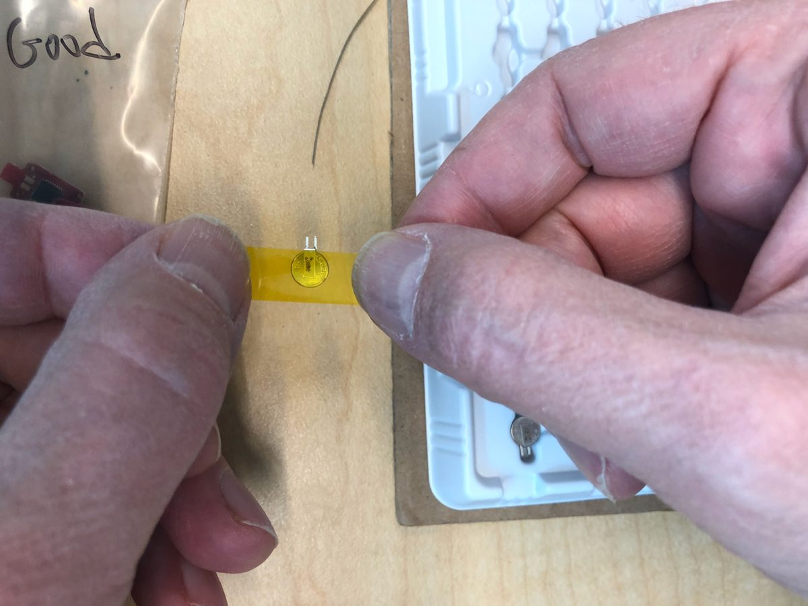
  <figcaption>The strip laid across the round face, clear of the terminals.</figcaption>
</figure>

<figure markdown>
  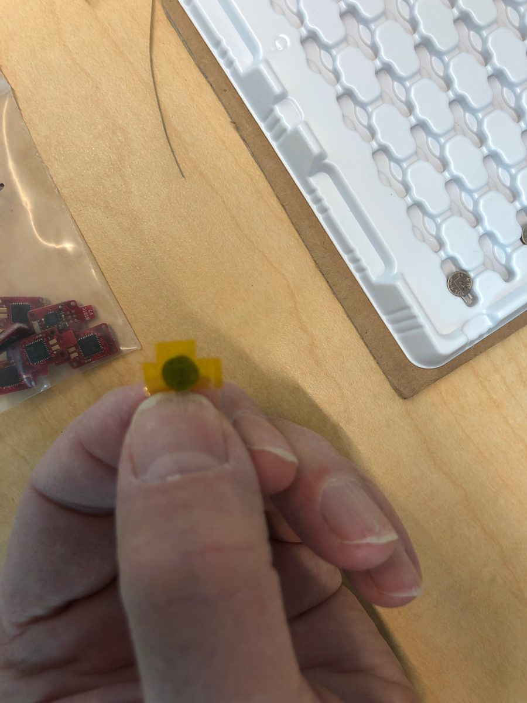
  <figcaption>Trimmed to a T, ready to fold down.</figcaption>
</figure>

!!! warning

    Tape must not make contact with the battery terminals. Keep fingers off the
    adhesive that will touch the battery; use tweezers or a wooden stir stick
    to position it.

??? note "Alternatives to Kapton"

    **Liquid electrical tape** was piloted on two tags and worked well. Fold a
    small piece of thin auto-body masking tape over the terminals, hold the
    battery by those masked terminals, and paint the liquid tape over the rest.
    Hang it to dry by a long piece of tape attached to the masked terminals. It
    was workable after about an hour; overnight is better. A second coat may be
    worth trying if it does not add too much weight — untested.

    **Thinned and dipped.** Pour a small quantity of liquid electrical tape
    into a plastic medicine cup, thin it with a few drops of naphtha — not too
    much — and dip the battery with the leads masked off.

    **Clear polyurethane varnish**, brushed on, was suggested as a way to help
    bind everything together. Untested.

<figure markdown>
  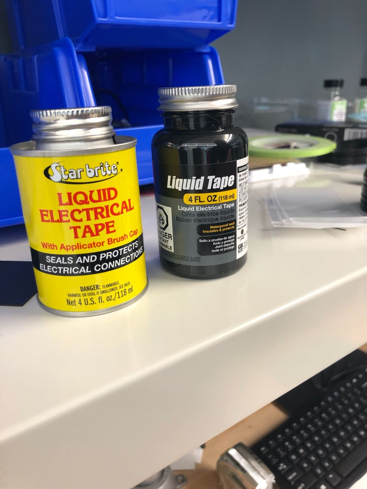
  <figcaption>Liquid electrical tape, the alternative to Kapton.</figcaption>
</figure>

### Solder it on

Work on a non-conductive surface under a microscope or opti-visor.

1. Apply flux to the battery attachment points on the tag.
2. Cut about an inch of auto-body masking tape and place it on the back of the
   tag by the battery stem — the "diving board". Working in your hand rather
   than on the bench, position the battery, hold it with a thumbnail on the
   terminals, and wrap the tape around to hold it. The terminals should sit
   over the copper contacts.

<figure markdown>
  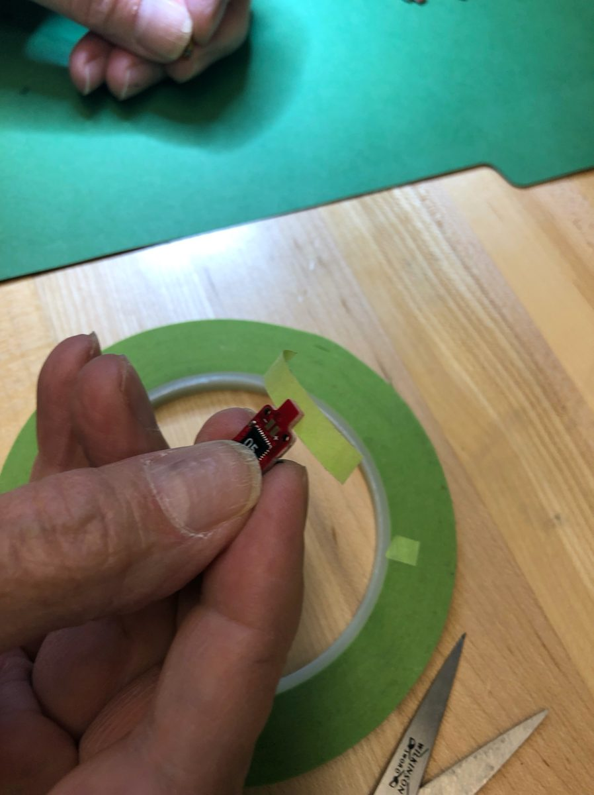
  <figcaption>Cutting the tape to length at the bench.</figcaption>
</figure>

<figure markdown>
  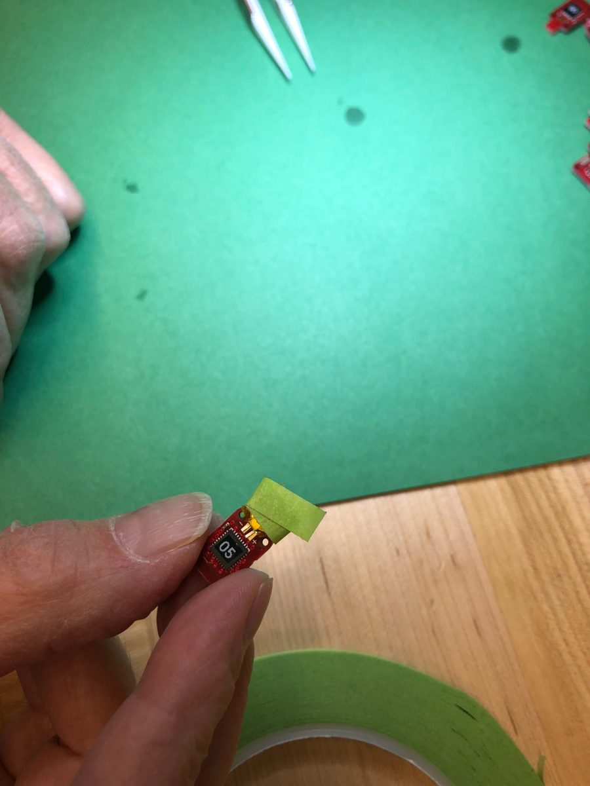
  <figcaption>Tape wrapped around the board to hold the battery while soldering.</figcaption>
</figure>

3. Position a terminal on its contact with the iron and heat for 5–10 seconds.
   Touch the solder, and withdraw it once it starts to flow. Smooth and spread
   with the iron, adding solder if needed, until the contact area carries a
   thin, even layer.
4. Hold the battery with your thumb as you remove the iron, pressing near the
   terminals. Pressure at the far end can lift the terminals off the contacts.
5. Repeat on the other side. You can leave the first side imperfect, do the
   second, and come back to clean it up.
6. Check the work: terminals flat, contacts fully covered, no clumps, terminals
   far enough down the tag to maximize contact. The solder should be shiny and
   smooth.
7. Remove any excess with clean solder wick — lay it over the joint, heat it
   with the iron, then cut off the used length and repeat.

!!! danger "Minimize heating time"

    Every second of iron on the board is heat into a tag you cannot replace.
    Keep the tip clean of excess solder as you work.

## 5. Coat the tags

### Prepare

1. Clean the soldered area with flux remover on a cotton swab.
2. Make hangers: cut 6–8 in lengths of green 24-gauge floral wire, fold each in
   half, and bend hooks into the ends with needle-nose pliers.
3. Mask the six copper contacts with a square of masking tape, positioned with
   tweezers and smoothed with a wooden stick. The tape should be only slightly
   wider than the contacts and must not hang over the side or cover anything
   else. Take care not to knock other components.
4. Hang the tag with the battery pointing down and the tag facing forward, then
   place it on the hanging rack with paper towel beneath.

<figure markdown>
  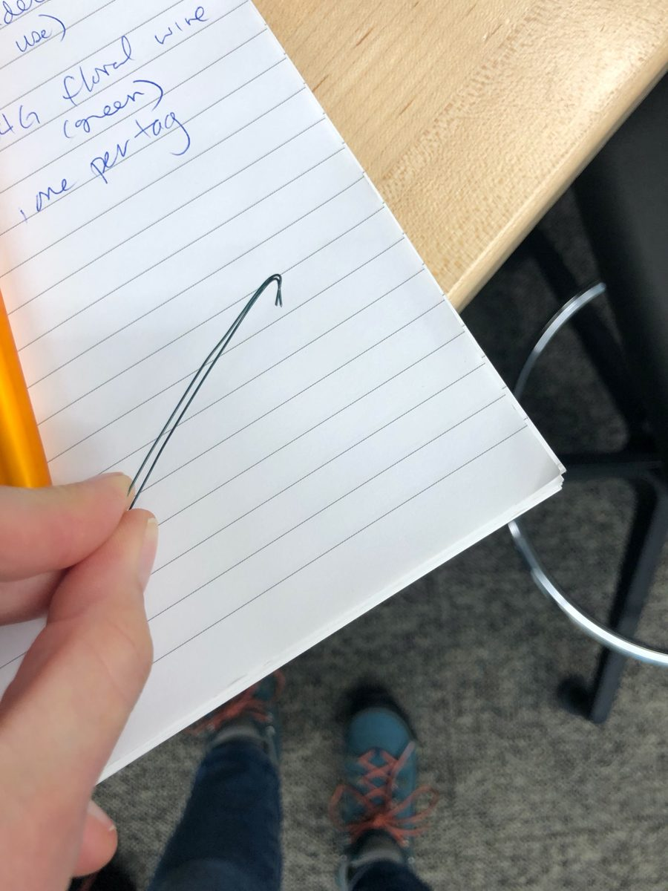
  <figcaption>A hanger: folded floral wire with hooked ends.</figcaption>
</figure>

<figure markdown>
  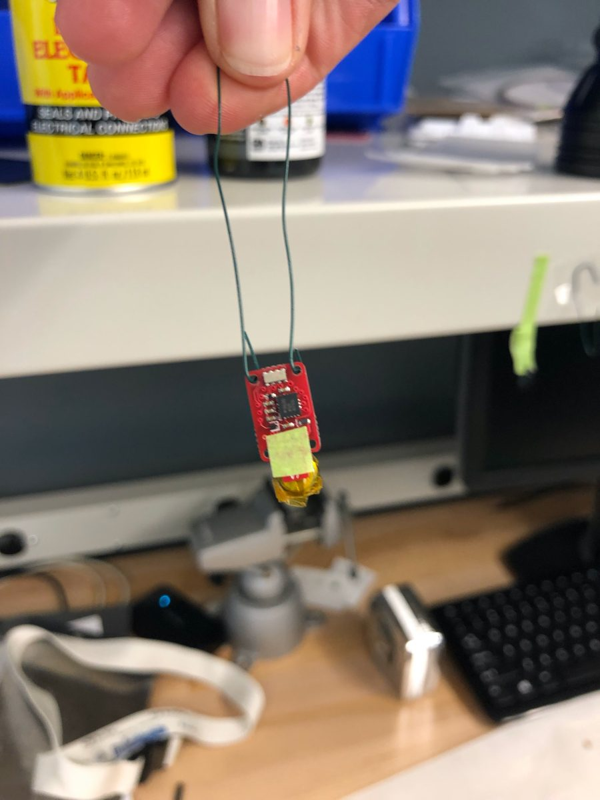
  <figcaption>Contacts masked, battery down, ready to dip.</figcaption>
</figure>

<figure markdown>
  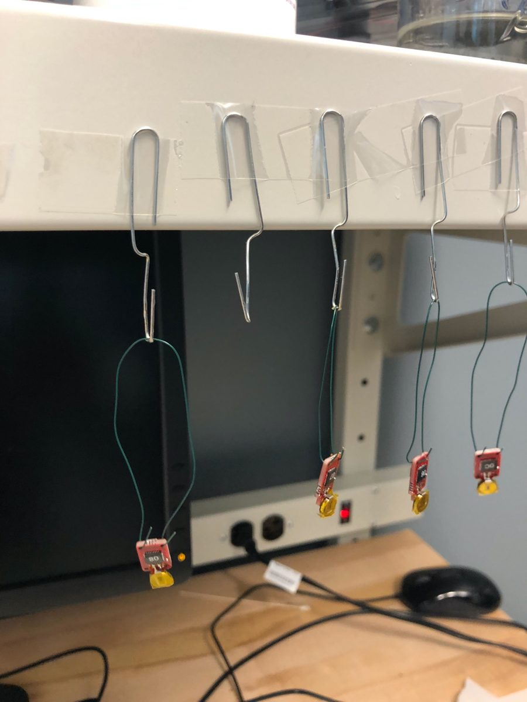
  <figcaption>The hanging rack: hooks taped along a shelf edge.</figcaption>
</figure>

### Dip

Dip the tag to fully submerge it, hold for 3–4 seconds, let it drip back into
the jar for a couple of seconds more, then hang it to dry over paper towel.

Tags should dry overnight, or about eight hours during the day — and not more
than 24 hours. Less is better.

<figure markdown>
  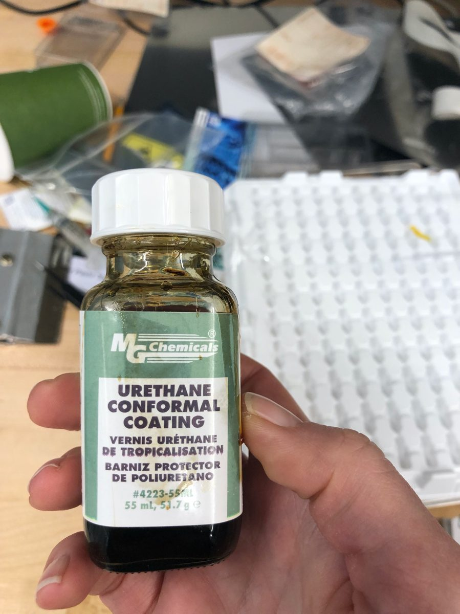
  <figcaption>The urethane conformal coating.</figcaption>
</figure>

<figure markdown>
  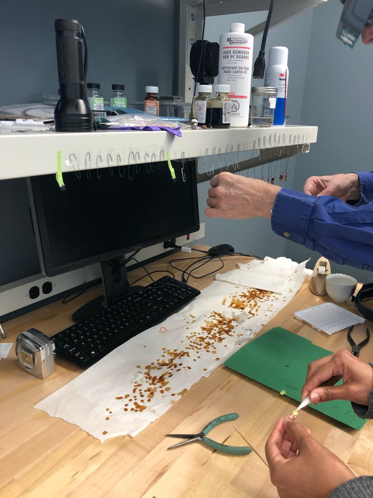
  <figcaption>The bench during a coating session.</figcaption>
</figure>

!!! note "Supply change"

    The MG Chemicals urethane is no longer sold in small quantities. The
    suggested replacement is Techspray 2104-12S urethane, brushed rather than
    dipped: two thickish coats on each side, 30–60 minutes apart. You will need
    something to hang the tags from — a piece of cardboard with bent paperclips
    taped to it works.

Clean the lip of the jar with flux cleaner before closing it. Buying a large
jar and decanting a working amount into a smaller one for dipping saves the
rest from contamination.

## 6. Clean up and verify

1. Remove the hanger by snipping one of the short wires close to the tag and
   the other part way up the hanger, then wiggling the wire gently free. Be
   careful here — the tag can break.
2. Remove the masking tape with tweezers.
3. Pare excess urethane off the board with an x-acto knife so it will seat in
   the base, mostly around the sides and front of the diving board. Remove any
   drips on the battery. Hold the knife close to the blade.
4. Clear the holes with a 1 mm drill bit in a pin vice.
5. Test the tag with Tag Monitor or the test program. Check clock drift and
   that the self-test reports **All Passed**.

!!! warning "The final drift check is a reject criterion"

    If the clock has drifted a lot since the tag was built, do not use it.

[Tag Monitor reference](https://tag-designs.github.io/software/user/apps/qtmonitor.html){ .md-button }

## 7. Record keeping

Keep a spreadsheet of tag setups with one row per tag:

| Column | Notes |
| --- | --- |
| Tag number | The two-digit code on the label |
| UUID | The tag's unique ID, read off the programmer |
| Board version | For example, v6 |
| Firmware version | Reported as the repo hash |
| Battery type | |

Keep the firmware version the same across all tags in a given experiment.

## Replacing a battery

Use a wider iron tip (T12 DL32).

1. Lay copper wick over the contacts and heat it with the iron, cutting fresh
   wick as it loads up.
2. Once enough solder is gone, hold the tag in your hand, apply the iron to the
   terminals and push the old battery off with a little pressure.
3. Clean the contacts as well as you can. They need not be bare copper, but
   should carry only a thin layer of solder.
4. Clean the area with flux cleaner — urethane remover also works if you have
   it — then follow the battery attachment steps above.

## Handling notes

- Keep tags in separate bags once a battery is attached.
- Unplug the base before removing a tag from it, especially during final setup
  before deployment.
- A second coat of urethane after a couple of hours adds durability at the cost
  of some weight.
