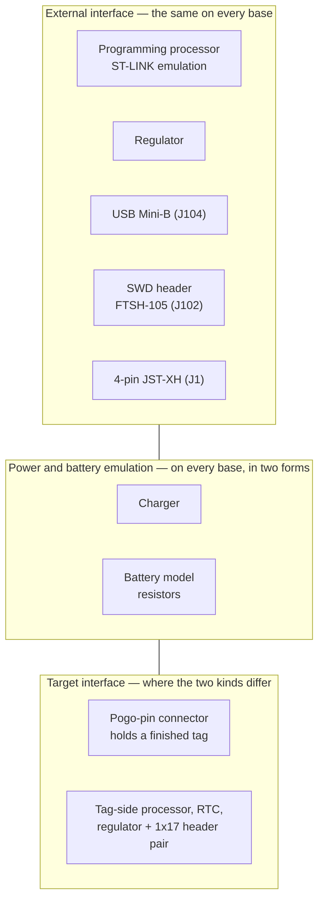

# Base Boards

A tag has no connector, no USB and no programming interface. Everything needed
to configure one, program it, charge it and measure what it draws lives on a
base board instead, and is shared across every tag rather than repeated on each.

That division is what makes a one-gram tag possible: the tag carries only what
has to fly.

## The shape of a base board

Every base board is built from the same three sections.

**The external interface is literally the same hardware.** All four boards carry
an FTSH-105-01-F-D-K SWD header as `J102`, a USB Mini-B as `J104` and a 4-pin
JST-XH as `J1`, alongside a processor whose firmware emulates the ST-LINK
protocol so that openocd, st-util and the rest work against a tag unmodified.
That section is documented here once rather than on four pages.

**Every base has a charger**, but the word covers two quite different circuits.
For a LiPo cell it is a real charger IC. For the MS621 and similar coin cells it
is simply a 3.3 V supply through a fixed resistor — so the "charger" is a
selectable array of resistors and a DIP switch. On `tagbase-v7` that is
four 620 Ω resistors against a 4-way switch.

Some boards additionally carry **battery models**: resistors chosen to match the
internal resistance of real cells, so a tag can be exercised against a realistic
source impedance without a battery present. `tagbase-v7` has a 33 Ω and a
100 Ω resistor for this.

**The target interface is where the two kinds of base diverge**, and it is the
only section that differs.

## Two kinds of base

| | Holds | Target interface | Boards |
| --- | --- | --- | --- |
| **Tag bases** | A finished tag | 6-pin pogo connector pressing on the tag's test pads | [tagbase-v7](tagbase-v7.md), [tagbase-lipo-v1](tagbase-lipo-v1.md) |
| **Breakout bases** | A prototype board | Tag-side processor, RTC and regulator, plus a pair of 1×17 headers | [tag-breakout-l432v2](tag-breakout-l432v2.md), [tag-breakout-u375-smps-v1](tag-breakout-u375-smps-v1.md) |

A **tag base** is a test fixture: a finished tag drops into a 3D-printed holder
and spring-loaded pogo pins contact the six test pads on its underside.

A **breakout base** is something else. It carries the half of a tag that is not
being prototyped — the processor, the real-time clock and, where the design needs
one, a regulator — and exposes the rest on a pair of 1×17 headers. A
[prototype board](../prototypes/index.md) carrying the sensors and memory plugs
into those headers. Base plus prototype together make a tag that can be measured
long before a tag-shaped board is fabricated.

## Measuring what a tag draws

The base boards exist as much for measurement as for programming. The net names
tell the story: `TAG_3V3` and `TAG_3V3_EN` switch the supply to the target,
`TAG_VBAT` and `VBAT_ADC` monitor the battery node, and `TAG_MIRROR` — called
`PWR_IN_MIRROR` on the breakout bases — is the current mirror behind a dynamic
current measurement during firmware development.

### Handing the supply to a Joulescope

The measurement that matters most is made by an external
[Joulescope](https://www.joulescope.com/) rather than by anything on the board,
and that imposes a requirement every base has to meet: **when the Joulescope is
connected, the board's own supply to the tag processor must be disconnected.**
Two sources feeding one rail would make the instrument measure the wrong thing,
or nothing.

How the disconnect is made depends on what the tag runs from.

| Cell | Mechanism | Boards |
| --- | --- | --- |
| **LiPo** | A physical changeover — SPDT slide switches | `tagbase-lipo-v1`, `tag-breakout-u375-smps-v1` |
| **Coin cell** | A low-leakage analog switch, TS5A3159 | `tagbase-v7`, `tag-breakout-l432v2` |

The reason is what each supply looks like. A coin cell on these boards is not a
cell at all: it is 3.3 V through a selected resistor, so the path can be broken
by a low-leakage analog switch without the switch's own resistance mattering
much against the hundreds of ohms already in series. A LiPo is a real cell
delivering real current, and there the switch would sit directly in the measured
path — so the connection is made and broken physically instead.

`tagbase-v7` is the fullest expression of the analog-switch approach,
with four TS5A3159 parts gating `TAG_3V3_EN`, `TAG_VBAT_EN` and `ADC_EN` under
firmware control, so a measurement sequence can be scripted rather than set by
hand. `tag-breakout-l432v2` does the same job with one.

The external supply arrives on the 4-pin JST-XH at `J1`, on the net named
`EXT_PWR` on the older boards and `PWR_IN` on the newer ones.

## The four boards

| Board | Kind | Programming processor | Charger | Render |
| --- | --- | --- | --- | --- |
| [tagbase-v7](tagbase-v7.md) | Tag base | STM32F042G6 | Resistor array, 4×620 Ω | top |
| [tagbase-lipo-v1](tagbase-lipo-v1.md) | Tag base | STM32L432KB | XC6808 LiPo charger | top |
| [tag-breakout-l432v2](tag-breakout-l432v2.md) ⚠ | Breakout base | STM32F042K6 | Resistor array | top |
| [tag-breakout-u375-smps-v1](tag-breakout-u375-smps-v1.md) | Breakout base | STM32L432 | Resistor array | top |

⚠ `tag-breakout-l432v2` has a
[known wiring error](tag-breakout-l432v2.md): the processor's `PB6` and `PB7`
reach the RTC's `SDA` and `SCL` the wrong way round.

These boards are documented from the top only. Unlike the tags, nothing on their
undersides needs showing.
