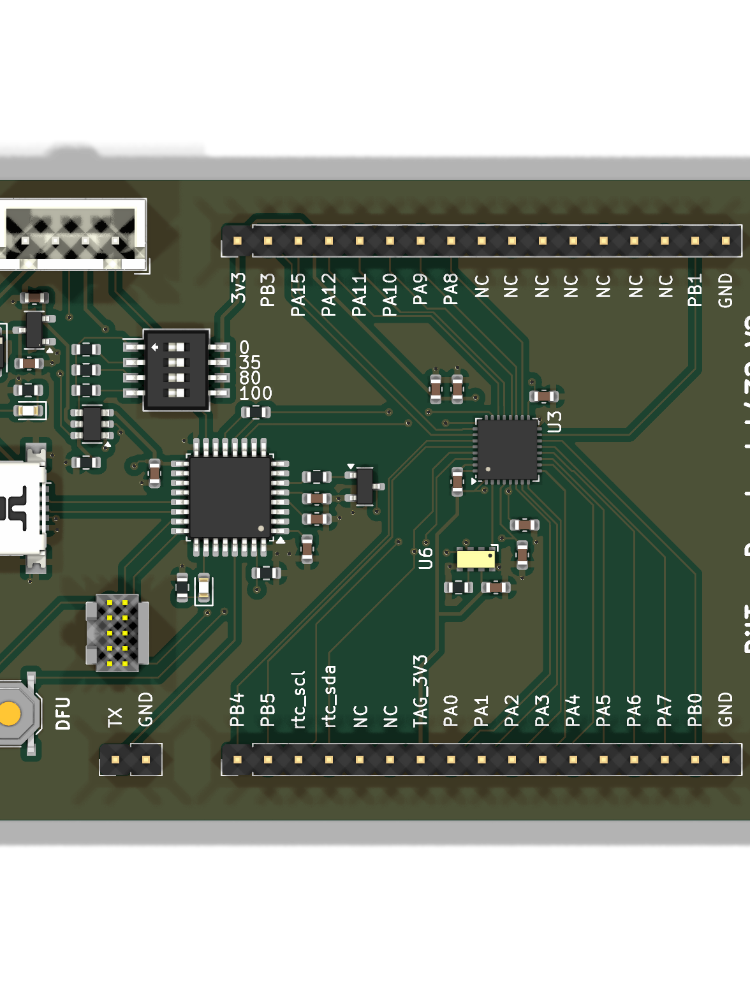
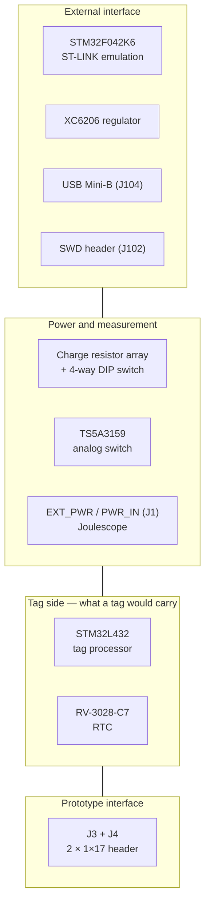

# tag-breakout-l432v2

A breakout base for the STM32L432 tag line. It carries the half of a tag that is
not being prototyped — processor and real-time clock — and exposes the rest on a
pair of 1×17 headers for a [prototype board](../prototypes/index.md) to plug
into.

<figure markdown>
  { width="420" }
  <figcaption>Top</figcaption>
</figure>

## Block diagram

## Major components

| Role | Part | Section |
| --- | --- | --- |
| Programming processor | STM32F042K6 | External interface |
| Regulator | XC6206 | External interface |
| Supply switching | TS5A3159ADBVR | Power — coin-cell line, so a low-leakage analog switch |
| Charge selection | `SW_DIP_x04` with 620 Ω resistors | Power |
| Tag processor | STM32L432 | Tag side |
| Tag RTC | RV-3028-C7 | Tag side |
| Reset | Q_NPN_BEC + Schottky ×2 | Tag side |
| Prototype interface | `J3`, `J4` — PinHeader_1x17 | Connector pair |

## What is distinctive

**No regulator on the tag side.** The STM32L432 runs directly from the supply,
as it does on the tag boards themselves. The U375 breakout needs one; this does
not.

**It prototypes the L432 tags.** Pair it with
[UIUCBreakout](../prototypes/uiuc.md), whose ADXL367, BMP585 and AT25FF321A are
exactly the sensor set of the
[UIUC tag](https://tag-designs.github.io/hardware/tags/uiuctag.html).

## Design files

[Design directory on GitHub](https://github.com/tag-designs/hardware/tree/main/BoardDesigns/Bases/tag-breakout-l432v2){ .md-button }
[Design notes](https://github.com/tag-designs/hardware/blob/main/BoardDesigns/Bases/tag-breakout-l432v2/DesignNotes.md){ .md-button }
