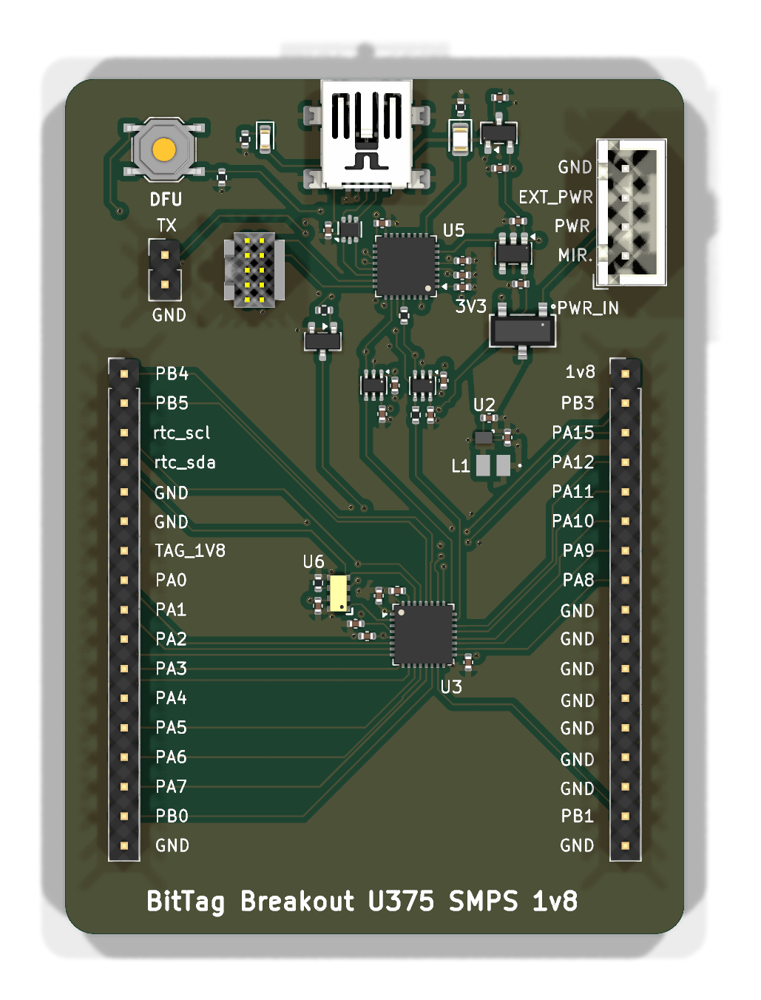
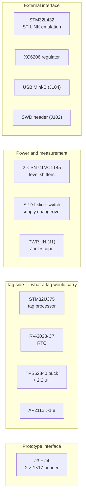

# tag-breakout-u375-smps-v1

The breakout base for the STM32U375 tag line — the line that became
[IMUTag](https://tag-designs.github.io/hardware/tags/imutag.html). It carries the
tag's processor, clock and regulator, and exposes the sensor side on a pair of
1×17 headers.

<figure markdown>
  { width="420" }
  <figcaption>Top</figcaption>
</figure>

## Block diagram

## Major components

| Role | Part | Section |
| --- | --- | --- |
| Programming processor | STM32L432KBU6 | External interface |
| Regulator | XC6206 | External interface |
| ESD | USBLC6-2P6 | External interface, on the USB port |
| Level shifters | SN74LVC1T45DCK ×2 | Between a 3.3 V interface and a 1.8 V target |
| Supply changeover | SW_SPDT | Power — LiPo line, so a physical changeover |
| Tag processor | STM32U375 | Tag side |
| Tag RTC | RV-3028-C7 | Tag side |
| Tag supply | TPS62840YBGR + 2.2 µH | Tag side — the switching converter the name refers to |
| Tag regulator | AP2112K-1.8 | Tag side |
| Prototype interface | `J3`, `J4` — PinHeader_1x17 | Connector pair |

## What is distinctive

**The SMPS in the name is a TPS62840 buck converter**, with the same 2.2 µH
inductor the production IMUTag carries. That is what separates this revision
from its siblings: `tag-breakout-u375-smps` and `tag-breakout-l432-u375-lipo-v1`
supply the tag side through a TPS7A0218 LDO behind a SiP32432 load switch, where
this board replaces both with the switching converter. The prototyping hardware
followed the tag design rather than lagging it.

**A 1.8 V tag side, which is why the level shifters are here.** The U375 tags run
their core at 1.8 V while the base's interface sits at 3.3 V, so every signal
crossing between them passes through an SN74LVC1T45.

**A physical supply changeover**, because this is the LiPo line — the production
IMUTag runs from a 12 mAh LiPo. The coin-cell breakout uses an analog switch for
the same job.

**It prototypes the IMUTag.** Pair it with
[IMUTagNandBMP581-breakout](../prototypes/imutag-nand-bmp581.md), whose BMM350,
BMP581, LSM6DSV and GD5F2GM7RE NAND are exactly the sensor and memory set of
`imutag-smps`.

!!! warning "The design review in this directory names a different board"

    `tag-breakout-u375-smps-v1` carries
    `tag-breakout-l432-u375-lipo-v1-design-review.md`, inherited from the board
    it was copied from. Two near-identical siblings exist —
    `tag-breakout-u375-smps` and `tag-breakout-l432-u375-lipo-v1` — and this is
    the one with the most recent fabrication output, including the only complete
    `production/` package of the three. It is also the only one of the three
    carrying the switching converter, so the review — written against an
    LDO-and-load-switch design — does not describe this board's power section.

## Design files

[Design directory on GitHub](https://github.com/tag-designs/hardware/tree/main/BoardDesigns/Bases/tag-breakout-u375-smps-v1){ .md-button }
[Schematic (PDF)](../schematics/tag-breakout-u375-smps-v1.pdf){ .md-button }
[Design review (named for a sibling board)](https://github.com/tag-designs/hardware/blob/main/BoardDesigns/Bases/tag-breakout-u375-smps-v1/tag-breakout-l432-u375-lipo-v1-design-review.md){ .md-button }
