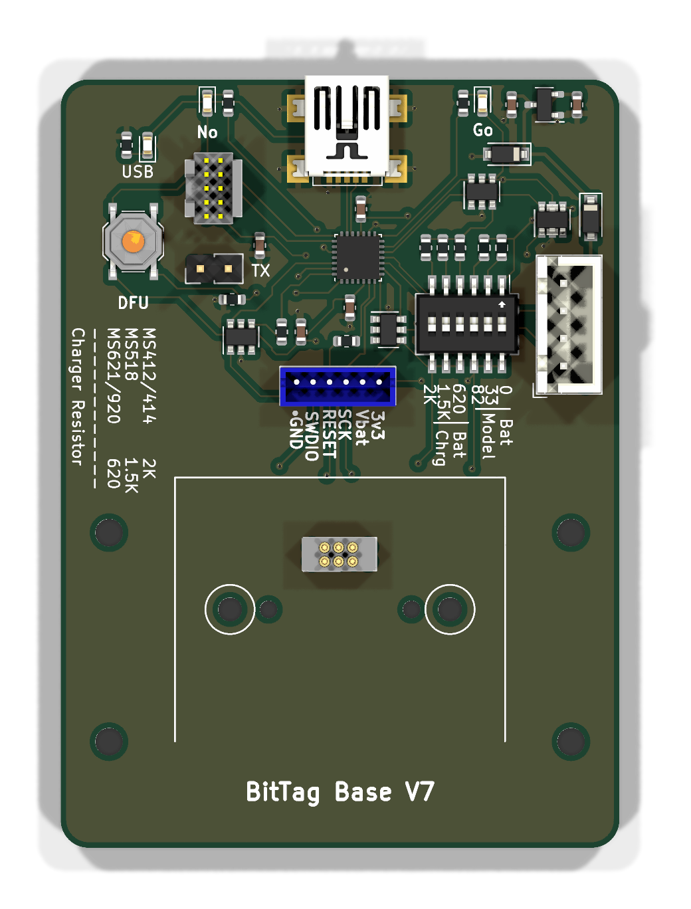
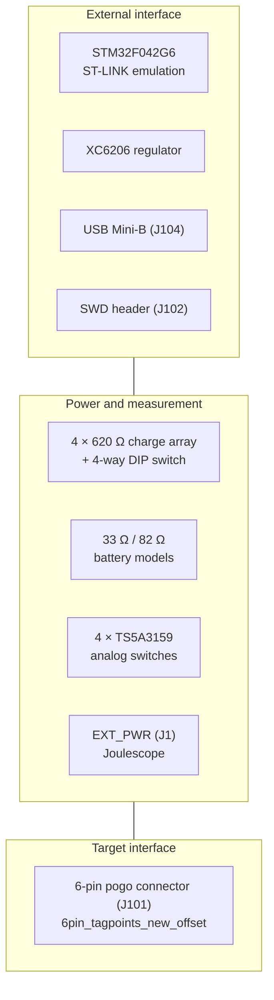

# tagbase-jlcpcb-v3

The original tag base, and the one most of the project's current measurements
were made on. A finished tag sits in a 3D-printed holder and six spring-loaded
pogo pins press on the test pads on its underside.

<figure markdown>
  { width="420" }
  <figcaption>Top</figcaption>
</figure>

## Block diagram

## Major components

| Role | Part | Notes |
| --- | --- | --- |
| Programming processor | STM32F042G6 | Emulates ST-LINK so openocd and st-util work unmodified |
| Regulator | XC6206 | |
| Supply switching | TS5A3159ADBVR ×4 | Low-leakage analog switches on `TAG_3V3_EN`, `TAG_VBAT_EN` and `ADC_EN` |
| Charger | 4 × 620 Ω + `SW_DIP_x04` | A coin cell charges from 3.3 V through a resistor; the switch picks which |
| Battery models | 33 Ω, 82 Ω | Sized to the internal resistance of real cells |
| Target connector | `6pin_tagpoints_new_offset` | Pogo pins onto the tag's six test pads |
| Indicators | Red and green LEDs, tactile switch | |

## What is distinctive

**Four independently gated supply paths.** This is the most elaborate of the
four bases in how it controls power to the tag, and the only one where the
gating is electronic rather than mechanical throughout. `TAG_3V3_EN`,
`TAG_VBAT_EN` and `ADC_EN` are firmware-controlled, so a measurement sequence
can be scripted rather than set by hand.

An analog switch works here because the coin cell it serves is not a cell: it
is 3.3 V through a selected resistor of several hundred ohms, against which the
switch's own on-resistance and leakage barely register. The LiPo bases cannot
make that trade and use a physical changeover instead — see
[the overview](index.md#handing-the-supply-to-a-joulescope).

!!! note "The directory was misnamed until 2026-10-08"

    This board lived in a directory called `tagbase-jlcpcb-v7` while containing
    `tagbase-jlcpcb-v3.kicad_pcb` throughout. Earlier notes and the
    `tagbase-lipo-v1` design review refer to it as `tagbase-jlcpcb-v7`,
    including the observation that it carries no fabrication artefacts in the
    repository yet *was* fabricated.

## Design files

[Design directory on GitHub](https://github.com/tag-designs/hardware/tree/main/BoardDesigns/Bases/tagbase-jlcpcb-v3){ .md-button }
[Schematic (PDF)](../schematics/tagbase-jlcpcb-v3.pdf){ .md-button }

No design review has been written for this board.
