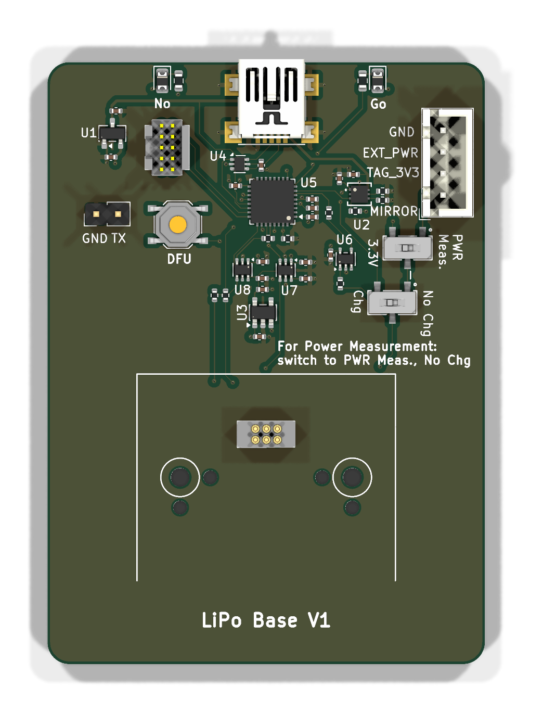
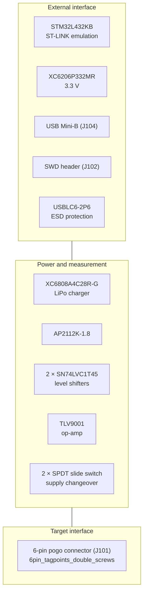

# tagbase-lipo-v1

A tag base for LiPo-powered tags. Where the coin-cell bases fake a charger with
a resistor, this board carries a real one — and it is the first of the bases to
hand the supply over to an external instrument with a mechanical switch rather
than an analog one.

<figure markdown>
  { width="420" }
  <figcaption>Top</figcaption>
</figure>

## Block diagram

## Major components

| Role | Part | Notes |
| --- | --- | --- |
| Programming processor | STM32L432KB | |
| Charger | XC6808A4C28R-G | A real LiPo charger, not a resistor |
| Regulators | XC6206P332MR, AP2112K-1.8 | 3.3 V and 1.8 V |
| Level shifters | SN74LVC1T45DCK ×2 | Between the 3.3 V interface and a 1.8 V target |
| Measurement | TLV9001IDCKR | |
| ESD | USBLC6-2P6 | On the USB port |
| Supply changeover | SW_SPDT ×2 | Mechanical, for handing the rail to a Joulescope |
| Target connector | `6pin_tagpoints_double_screws` | Pogo pins, with screw retention |

## What is distinctive

**A 1.8 V target.** The level shifters and the AP2112K-1.8 are here because a
LiPo-powered tag may run its core at 1.8 V while the base's own interface sits
at 3.3 V. The coin-cell bases have no such split.

**A physical supply changeover, because the cell is real.** Two SPDT slide
switches hand the rail to an external Joulescope. The coin-cell bases use a
low-leakage analog switch for the same job, and can afford to: their "cell" is
3.3 V through a few hundred ohms, so a switch's own resistance is lost in it.
A LiPo delivers real current into the path being measured, so the connection is
broken physically instead.

**The pogo connector has screw retention** — `6pin_tagpoints_double_screws`
rather than the plain offset footprint — which matters more for a LiPo tag,
since it is held against the pins for longer measurement runs.

## Design files

[Design directory on GitHub](https://github.com/tag-designs/hardware/tree/main/BoardDesigns/Bases/tagbase-lipo-v1){ .md-button }
[Schematic (PDF)](../schematics/tagbase-lipo-v1.pdf){ .md-button }
[Design review](https://github.com/tag-designs/hardware/blob/main/BoardDesigns/Bases/tagbase-lipo-v1/tagbase-lipo-v1-design-review.md){ .md-button }

The review is worth reading for its analysis of the pogo-pin footprint: the
0.2032 mm of laminate between the connector's locating-peg holes is the part's
own geometry and appears on every board carrying a tagpoint footprint.
