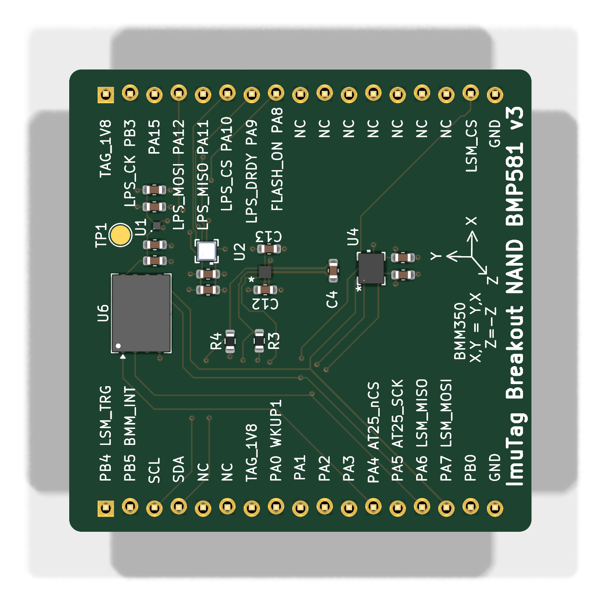
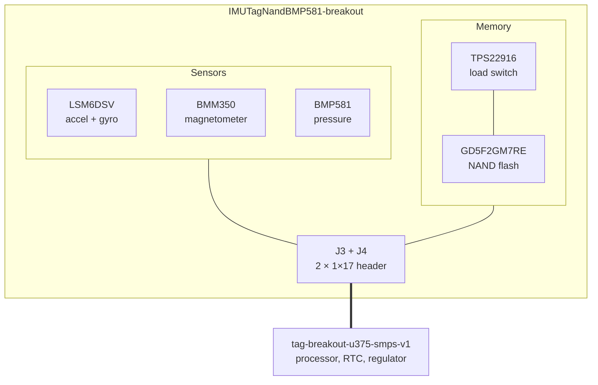

# IMUTagNandBMP581-breakout

The sensor and memory half of what became
[IMUTag](https://tag-designs.github.io/hardware/tags/imutag.html). Twenty-one
footprints, of which five are the parts that matter and two are the connectors
to the base.

<figure markdown>
  { width="420" }
  <figcaption>Top</figcaption>
</figure>

## Block diagram

## Major components

| Role | Part | Notes |
| --- | --- | --- |
| Inertial | LSM6DSV | 6-axis: acceleration and rotation rate |
| Magnetometer | BMM350 | |
| Pressure | BMP581 | Barometric pressure and temperature |
| Memory | GD5F2GM7REYIGR | NAND flash |
| Load switch | TPS22916BYFPR | Gates the NAND's supply |
| Base interface | `J3`, `J4` — PinHeader_1x17 | |

## What is distinctive

**It still has the load switch the production tag dropped.** `TPS22916` gates
the NAND's supply here, exactly as it originally did on `imutag-smps`. On the
tag that switch was removed in September 2026 after power measurements showed
its benefit was negligible, and the NAND was wired straight to the 1.8 V rail.

The prototype preserves the design as it stood when the question was still open
— which is the useful thing about keeping prototype boards around. The
measurement that settled it was made on hardware like this.

## Design files

[Design directory on GitHub](https://github.com/tag-designs/hardware/tree/main/BoardDesigns/Prototypes/IMUTagNandBMP581-breakout){ .md-button }
[Schematic (PDF)](../schematics/IMUTagNandBMP581-breakout.pdf){ .md-button }

No design review has been written for this board. The
[imutag-smps review](https://github.com/tag-designs/hardware/blob/main/BoardDesigns/Tags/imutag-smps/imutag-smps-design-review.md)
covers the same sensor set as it reached the tag, including the reasoning behind
removing the load switch.
