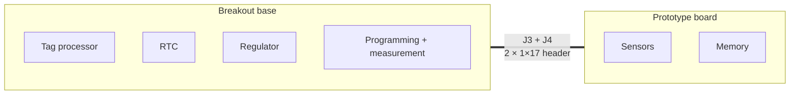

# Prototype Boards

A prototype board is the half of a tag that is being designed. It carries the
sensors and the memory, and nothing else — no processor, no clock, no regulator,
no power supply. Those come from a
[breakout base](../bases/index.md), which the prototype plugs into.

Base plus prototype together make a working tag that can be programmed, measured
against a Joulescope and flown on a bench long before a tag-shaped board is
fabricated.

## The shared interface

Every prototype board mates the same way: **two 1×17 pin headers, `J3` and
`J4`**, matching the pair on each breakout base. That is the whole interface.

On the prototype side those headers are usually the *only* footprints that are
not a sensor, a memory or a decoupling capacitor. `UIUCBreakout` has thirteen
footprints in total and two of them are the connectors.

## Which base, and which tag

A prototype pairs with the breakout base matching its processor family, and
together they stand in for a production tag whose sensor set they share exactly.

| Prototype | Sensors and memory | Breakout base | Prototypes the tag |
| --- | --- | --- | --- |
| [IMUTagNandBMP581-breakout](imutag-nand-bmp581.md) | BMM350, BMP581, LSM6DSV, GD5F2GM7RE NAND | [tag-breakout-u375-smps-v1](../bases/tag-breakout-u375-smps-v1.md) | [IMUTag](https://tag-designs.github.io/hardware/tags/imutag.html) |
| [UIUCBreakout](uiuc.md) | ADXL367, BMP585, AT25FF321A | [tag-breakout-l432v2](../bases/tag-breakout-l432v2.md) | [UIUC tag](https://tag-designs.github.io/hardware/tags/uiuctag.html) |
| [steval-daughter-v2](steval-daughter.md) | AT25FF321 flash, plus a socket for ST evaluation boards | Either | — generic |

The pairing follows the processor family, which in turn follows the battery
chemistry: the U375 line runs from a LiPo and the L432 line from a coin cell,
and that distinction reaches all the way back into
[how the base hands its supply to a Joulescope](../bases/index.md#handing-the-supply-to-a-joulescope).

## The generic carrier

`steval-daughter-v2` is the odd one out and deliberately so. Rather than
carrying a fixed sensor set, it carries a socket for ST's own evaluation boards,
so any sensor ST ships on a STEVAL card can be driven by the project's firmware
and measured on the project's bench. It adds a flash chip of its own, since most
of those cards have none.

These boards are documented from the top only. Nothing on their undersides needs
showing.
