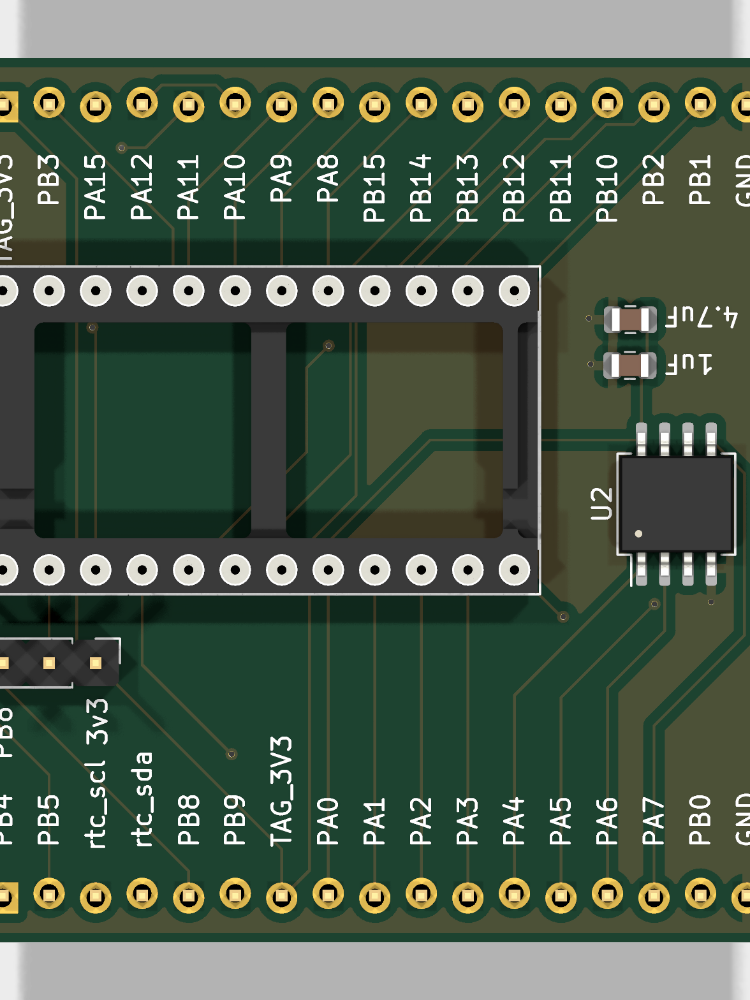
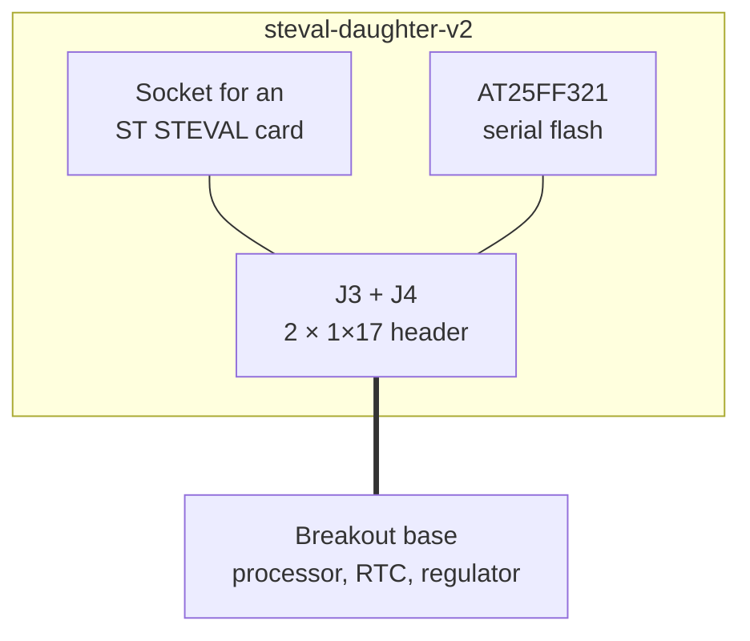

# steval-daughter-v2

A generic carrier. Where the other prototype boards commit to a fixed sensor
set, this one carries a socket for ST's own evaluation boards, so any sensor ST
ships on a STEVAL card can be driven by the project's firmware and measured on
the project's bench.

<figure markdown>
  { width="420" }
  <figcaption>Top</figcaption>
</figure>

## Block diagram

## Major components

| Role | Part | Notes |
| --- | --- | --- |
| Evaluation socket | ST STEVAL card socket | Whatever sensor the card carries |
| Memory | AT25FF321 | Serial flash, because most STEVAL cards have none |
| Base interface | `J3`, `J4` — Conn_01x17 | |

## What it is for

**Evaluating a sensor before committing a board to it.** ST publishes STEVAL
evaluation cards for most of its sensor range. Socketing one here puts it behind
the same processor, the same firmware and the same measurement setup as a real
tag, so the question "what would this part cost us in microamps" can be answered
without laying out a board.

**The flash is the board's own contribution.** A STEVAL card provides a sensor
and little else, so recording anything from it needs memory the carrier
supplies.

This is the oldest of the three prototype boards and shows it: its KiCad file
predates the others, and its 3D models were the only ones in the project still
referencing VRML (`.wrl`) geometry that KiCad has since stopped shipping.

## Design files

[Design directory on GitHub](https://github.com/tag-designs/hardware/tree/main/BoardDesigns/Prototypes/steval-daughter-v2){ .md-button }
[Schematic (PDF)](../schematics/steval-daughter-v2.pdf){ .md-button }

No design review has been written for this board.
