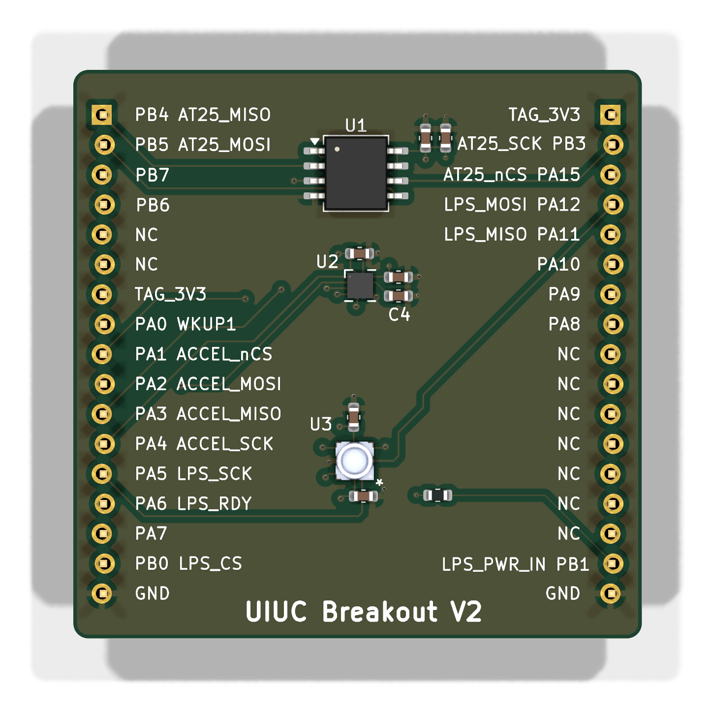
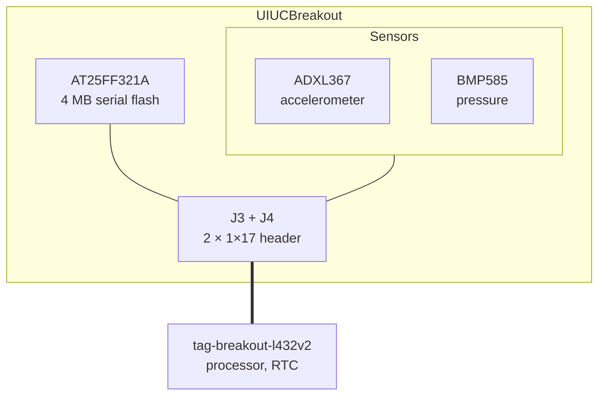

# UIUCBreakout

The sensor and memory half of the
[UIUC tag](https://tag-designs.github.io/hardware/tags/uiuctag.html). Thirteen
footprints, three of them the parts being prototyped.

<figure markdown>
  { width="420" }
  <figcaption>Top</figcaption>
</figure>

## Block diagram

## Major components

| Role | Part | Notes |
| --- | --- | --- |
| Accelerometer | ADXL367BCCZ-RL7 | Hardware activity/inactivity state machine |
| Pressure | BMP585 | Barometric pressure and temperature |
| Memory | AT25FF321A-SHN-B | 4 MB serial flash, low quiescent current |
| Base interface | `J3`, `J4` — PinHeader_1x17 | |

## What is distinctive

**The sensor set is identical to the production tag's.** ADXL367, BMP585 and
AT25FF321A are exactly what `BitPresTagBMP585` carries, so what is measured here
is what the tag will do. The difference is only in packaging and in what the
base supplies.

**The flash is in a different package.** This board uses the `-SHN-B` variant of
the AT25FF321A where the tag uses `-UUN-T` — a prototype can afford a part that
is easier to hand-solder.

!!! note "There is a second analysis document in this directory"

    Alongside `UIUCBreakout-design-review.md` sits
    `TorporTagBreakout-analysis.md`, named for a different board. The project has
    a history of copying a board directory as the starting point for the next
    one, and the stray file is a leftover of that rather than a document about
    this board.

## Design files

[Design directory on GitHub](https://github.com/tag-designs/hardware/tree/main/BoardDesigns/Prototypes/UIUCBreakout){ .md-button }
[Schematic (PDF)](../schematics/UIUCBreakout.pdf){ .md-button }
[Design review](https://github.com/tag-designs/hardware/blob/main/BoardDesigns/Prototypes/UIUCBreakout/UIUCBreakout-design-review.md){ .md-button }
