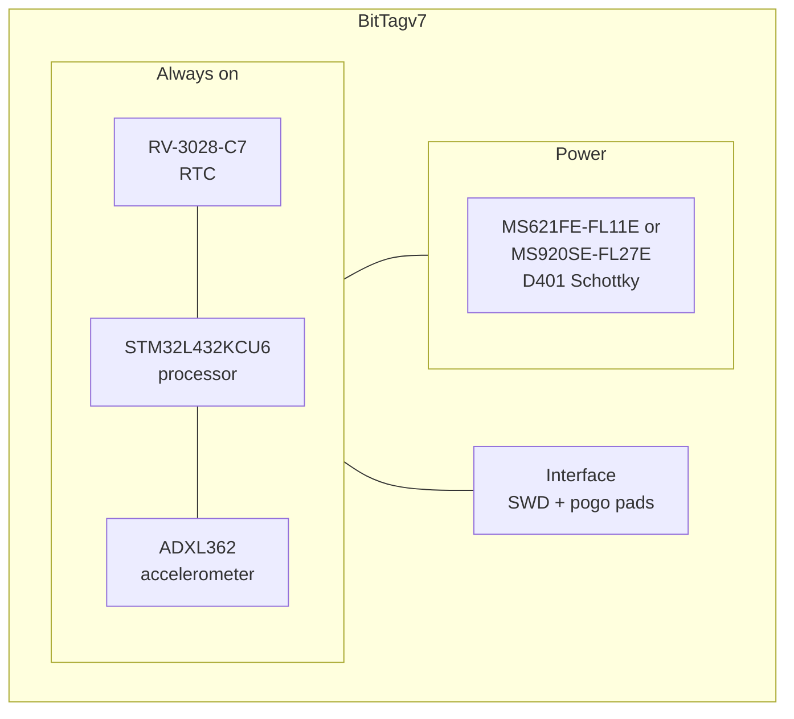

# BitTag

BitTag is the smallest tag in the family and the one the whole architecture is
named for. It answers a single question — *when was the bird active?* — and
spends almost nothing doing it. The board documented here is **BitTagv7**.

## Block diagram

There is no switched section. Every part on this board is low enough in
quiescent current to stay powered for the life of the deployment, so nothing
needs a load switch.

## Major components

| Role | Part | Notes |
| --- | --- | --- |
| Processor | STM32L432KCU6 | Cortex-M4; the deep sleep states are what make the energy budget work |
| RTC | RV-3028-C7 | 32.768 kHz, 1 ppm, ~40 nA |
| Sensor | ADXL362BCCZ | 3-axis accelerometer with a hardware activity/inactivity state machine |
| Memory | *(internal only)* | No external flash — records go to the processor's own flash |
| Power | D401 CDBQC0130L-HF | Schottky reverse-polarity protection; no regulator |
| Battery | MS621FE-FL11E or MS920SE-FL27E | 5.5 mAh / 230 mg, or 11 mAh / 450 mg |

**Memory is the thing to notice.** BitTagv7 carries no external flash chip at
all: 18 placed footprints, and none of them is a memory part. Activity records
live in the STM32L432's internal flash. That is what keeps the board small and
the standby current low, and it is also what bounds how much a BitTag can
record before it must be recovered.

**There is no regulator either.** Parts run directly at battery voltage less
one Schottky drop. With a 3 V coin cell that lands near 2.8 V, comfortably
inside the 1.71–3.6 V window the STM32 and the ADXL362 share.

!!! warning "The cell chemistry is not a free choice"

    This board takes one of two Seiko rechargeable coin cells: the
    **MS621FE-FL11E** (5.5 mAh, 230 mg) or the **MS920SE-FL27E** (11 mAh,
    450 mg). Which one is a mass-versus-endurance decision for the deployment.

    Neither may be swapped for a 3.7 V LiPo. Without a regulator the rail
    follows the cell, and a LiPo charged to 4.2 V would put roughly 4.0 V on it
    — the absolute maximum rating of both the processor and the accelerometer,
    not merely outside their operating range.

## What it records

The ADXL362 does the sensing without waking the processor. When an active
accelerometer sees acceleration below a programmed threshold for a programmed
period it drops into an inactive state and samples at 6 Hz; when an inactive
accelerometer sees acceleration above threshold it wakes and samples faster.
The firmware wakes the processor only on the transitions between those two
states, and from them reconstructs when the bird was active.

The result is one activity bit per second, aggregated over an interval between
one second and five minutes. That is a coarse record by design: it is what
allows a BitTag to run for most of a year on a 5.5 mAh cell.

## Design files

[Design directory on GitHub](https://github.com/tag-designs/hardware/tree/main/BoardDesigns/Tags/BitTagv7){ .md-button }

No design review has been written for this board.
