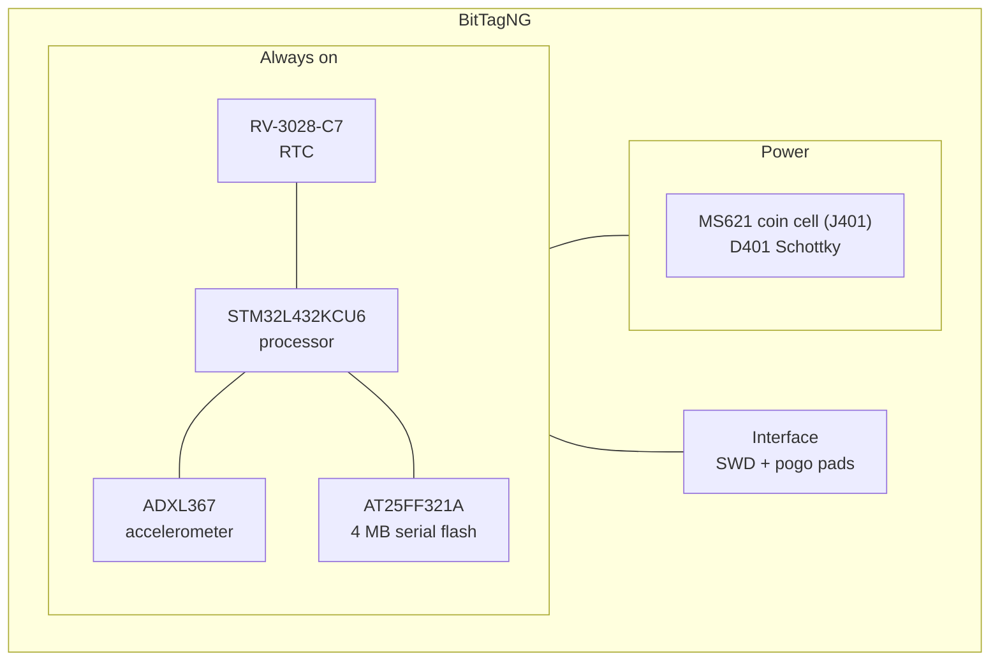

# BitTagNG

BitTagNG is a BitTag with external memory. The schematic's own title block calls
it exactly that. It keeps the BitTag idea — an accelerometer with a hardware
activity state machine, a processor that sleeps between transitions — and adds a
flash chip so the record is no longer bounded by the processor's internal flash.

!!! note "Fabricated and tested, but possibly a dead end"

    This board has been built and exercised. Whether it becomes the line BitTag
    development continues along is not settled; it is documented here because it
    exists and was measured, not because it supersedes
    [BitTagv7](bittag.md).

## Block diagram

No switched section. Both the accelerometer and the flash were chosen for
quiescent currents low enough to stay powered, so there is nothing a load switch
would earn back.

## Major components

| Role | Part | Notes |
| --- | --- | --- |
| Processor | STM32L432KCU6 | |
| RTC | RV-3028-C7 | 32.768 kHz, 1 ppm |
| Sensor | ADXL367BCCZ | 3-axis accelerometer; successor to the ADXL362 in BitTagv7 |
| Memory | AT25FF321A-UUN | 4 MB serial flash, low quiescent current |
| Power | D401 CDBQC0130L-HF | Schottky reverse-polarity protection; no regulator |

**The power tree is one diode deep.** An MS621 3 V rechargeable coin cell feeds
`VBAT`, D401 drops it to a `VIN` of roughly 2.8 V, and every device on the board
runs from that directly — processor, accelerometer, flash and RTC alike. The
binding constraint is the 3.6 V shared operating limit of the STM32 and the
ADXL367, against a 4.0 V absolute maximum on both.

!!! warning "Do not substitute a 3.7 V LiPo"

    Charged to 4.2 V, a LiPo would put `VIN` at roughly 4.0 V — the absolute
    maximum of both the processor and the accelerometer.

## What it records

The same activity record as a BitTag — one bit per second, aggregated — but
written to 4 MB of external flash rather than to the processor's internal flash.
That is the whole point of the board: it removes the memory ceiling, so the
limit on a deployment becomes the battery and the recovery date rather than the
space available for records.

## Design files

[Design directory on GitHub](https://github.com/tag-designs/hardware/tree/main/BoardDesigns/Tags/BitTagNG){ .md-button }
[Design review](https://github.com/tag-designs/hardware/blob/main/BoardDesigns/Tags/BitTagNG/BitTagNG-design-review.md){ .md-button }

The review covers the power tree and rail headroom, pinout verification across
all five active devices, and the resolution of three original blocking findings.
