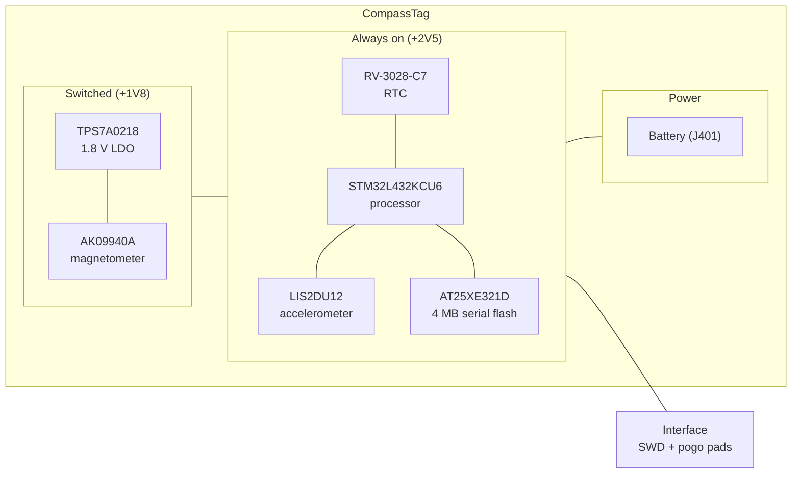

# CompassTag

CompassTag adds a magnetometer, which makes heading a recoverable quantity
rather than an inferred one. It is also the first board in the family to carry a
second voltage rail, because the magnetometer it uses will not run at battery
voltage.

## Block diagram

## Major components

| Role | Part | Domain | Notes |
| --- | --- | --- | --- |
| Processor | STM32L432KCU6 | Always on, +2V5 | |
| RTC | RV-3028-C7 | Always on, +2V5 | 32.768 kHz, 1 ppm |
| Sensor | LIS2DU12 | Always on, +2V5 | 3-axis accelerometer |
| Sensor | AK09940A | **Switched, +1V8** | 3-axis magnetometer |
| Regulator | TPS7A0218 | — | 1.8 V LDO serving only the magnetometer |
| Memory | AT25XE321D-UUN | Always on, +2V5 | 4 MB serial flash |

**The magnetometer has a rail of its own.** The AK09940A runs at 1.8 V, so it
cannot share the +2V5 rail the rest of the board uses. The TPS7A0218 LDO
supplies it, and that LDO's enable pin is wired to processor pin `PA9` on the net
`AK_PWR`. Switching the magnetometer off therefore switches off its regulator
too — the entire 1.8 V domain collapses, rather than the sensor idling on a live
rail. That is why the LDO is drawn inside the switched section rather than
alongside the battery.

The accelerometer stays powered. It is a low quiescent current part and it is
what the processor watches to decide when anything interesting is happening.

!!! note "Two firmware contracts come with the switched rail"

    The magnetometer's bus lines are driven from the +2V5 domain. While the 1.8 V
    rail is off, driving `AK_CK`, `AK_MOSI` or `AK_CS` high risks back-powering
    the sensor through its protection diodes, so those pins want to be high-Z or
    pulled low whenever the domain is down. Separately, `AK_RSTN` should be held
    low while the rail is off or still settling.

## What it records

Three-axis acceleration and three-axis magnetic field. Together these give
orientation and heading: the accelerometer establishes which way is down, and
the magnetometer gives a bearing relative to it. The design intent is roughly
10 µA typical current, under 1 mA while actively operating, and about 10 mA at
the peak of a flash write.

## Design files

[Design directory on GitHub](https://github.com/tag-designs/hardware/tree/main/BoardDesigns/Tags/CompassTag){ .md-button }
[KiCad analysis](https://github.com/tag-designs/hardware/blob/main/BoardDesigns/Tags/CompassTag/CompassTag-analysis.md){ .md-button }

The analysis document carries the full processor pin map with a recommended
reset and sleep state for every pin, which is the most useful thing in it if you
are writing firmware for this board.
