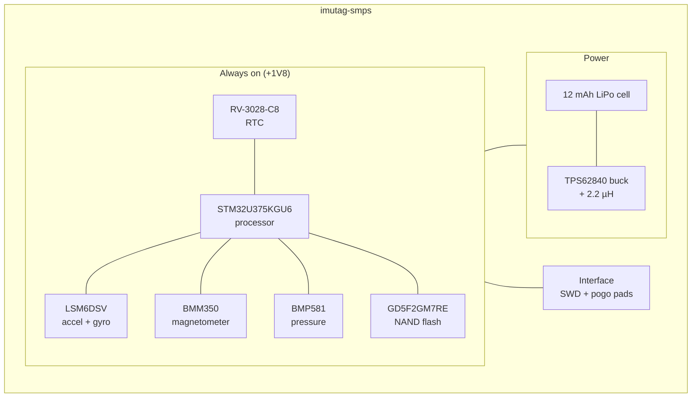

# IMUTag

IMUTag is the high-rate end of the family. Where a BitTag spends one bit per
second, an IMUTag resolves individual wingbeats — and fills its memory in a day
doing it. The board documented here is **imutag-smps**: the revision with a
switching regulator and NAND flash.

## Block diagram

**There is no switched section, and that is a deliberate result rather than an
omission.** An earlier revision gated the NAND flash behind a TPS22916 load
switch on `FLASH_PWR`. Power measurements showed the benefit was negligible, so
in September 2026 the load switch, its two capacitors and both of its nets were
removed and the NAND was wired straight to `+1V8`. The trade is that the NAND's
standby current is now drawn continuously — measured, accepted, and worth
re-measuring rather than re-assuming if the deployment duty cycle ever changes
materially.

## Major components

| Role | Part | Notes |
| --- | --- | --- |
| Processor | STM32U375KGU6 | The only board in the family not on an STM32L4 |
| RTC | RV-3028-C8 | 32.768 kHz, 1 ppm |
| Sensor | LSM6DSV | 6-axis inertial measurement: acceleration and rotation rate |
| Sensor | BMM350 | 3-axis magnetometer |
| Sensor | BMP581 | Barometric pressure and temperature |
| Memory | GD5F2GM7REYIGR | NAND flash — far larger than the serial flash the other tags carry |
| Power | TPS62840YBGR + 2.2 µH | Step-down switching converter producing +1V8 |
| Battery | 12 mAh LiPo | Specific cell not yet settled |

**This is the only tag with a switching converter.** Every other board in the
family runs its parts directly from the cell through a Schottky diode. At
IMUTag's sampling rates the processor and sensors draw enough that a buck
converter's efficiency earns its complexity — and the whole board then sits on a
single regulated 1.8 V rail rather than on a battery voltage that sags as the
cell drains.

The converter is also what lets this board use a different cell. Every other tag
is tied to a 3 V coin cell because its parts sit directly on the rail; put a
4.2 V LiPo on one and you are at the absolute maximum of the processor. Here the
TPS62840 steps whatever the cell gives down to a regulated 1.8 V, so a **12 mAh
LiPo** is usable — more capacity than a coin cell, and a rail that stays at
1.8 V rather than sagging as the cell drains. The specific cell is not yet
settled.

Using the YBG package has one consequence worth knowing: it has no MODE pin, so
forced-PWM operation is not available on this board.

## What it records

Acceleration, rotation rate, magnetic field, pressure and temperature, at
sampling rates from 100 Hz to 1600 Hz. At those rates the question stops being
"was the bird active" and becomes "how did it move" — wingbeat by wingbeat,
including the orientation and altitude context around each flight.

The cost is endurance. An IMUTag records continuously for hours rather than
months, and spends the rest of its deployment armed and waiting for a trigger.
The [IMUTag overview](https://tag-designs.github.io/software/user/imutag-overview.html)
on the software site carries the current figures for both.

## Design files

[Design directory on GitHub](https://github.com/tag-designs/hardware/tree/main/BoardDesigns/Tags/imutag-smps){ .md-button }
[Design review](https://github.com/tag-designs/hardware/blob/main/BoardDesigns/Tags/imutag-smps/imutag-smps-design-review.md){ .md-button }

The review is the most thorough in the repository: two rounds covering the
switching converter and its loop layout, the magnetometer noise and offset
budget, the full STM32U375 pin map including the SPI1 collisions, and the
reasoning behind removing the load switch. An earlier non-SMPS revision is in the
repository under `BoardDesigns/Tags/imutag`.
