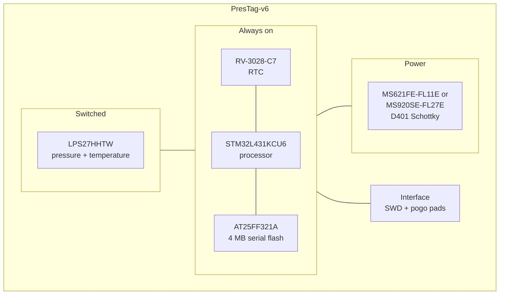

# PresTag

PresTag trades the accelerometer for a barometric pressure sensor. Where a
BitTag tells you *when* a bird was active, a PresTag tells you *how high* it
was, and when it climbed or descended. The board documented here is
**PresTag-v6**.

## The board

<figure markdown>
  
  <figcaption>Top</figcaption>
</figure>

<figure markdown>
  
  <figcaption>Bottom</figcaption>
</figure>

The LPS27's circular pressure port is visible at the centre of the top side. These are rendered from the KiCad layout by `kicad-cli`; see
[Board Designs](../boards/index.md) for how they are regenerated.

## Block diagram

The pressure sensor sits in the switched section because it is fed from its own
supply line, `LPS_PWR`, driven by a processor pin rather than by the main rail.

## Major components

| Role | Part | Domain | Notes |
| --- | --- | --- | --- |
| Processor | STM32L431KCU6 | Always on | |
| RTC | RV-3028-C7 | Always on | 32.768 kHz, 1 ppm |
| Sensor | LPS27HHTW | **Switched** | Barometric pressure and temperature |
| Memory | AT25FF321A-UUN | Always on | 4 MB; unusually low quiescent current for serial flash |
| Power | D401 CDBQC0130L-HF | — | Schottky reverse-polarity protection; no regulator |
| Battery | MS621FE-FL11E or MS920SE-FL27E | — | 5.5 mAh / 230 mg, or 11 mAh / 450 mg |

**Why the pressure sensor is gated.** The LPS27 draws about 0.9 µA just sitting
idle. On a tag whose whole budget is measured in microamps that is not a
rounding error, so its supply is switched off between samples rather than left
standing. The flash is the opposite case: the AT25FF321A was chosen precisely
because its quiescent current is low enough to leave powered, which is why it
sits in the always-on section next to the processor.

!!! note "Driving a sensor rail from a GPIO has a firmware contract"

    While the sensor rail is off, its bus lines are still driven from the main
    domain. Firmware must not leave them high, or the sensor can be
    back-powered through its protection diodes.

## What it records

Pressure and temperature, sampled at a configurable period. Barometric pressure
converts to altitude, so a PresTag record is a flight-altitude profile: how high
the bird flew, and the shape and timing of its climbs and descents.

The sample period sets the deployment length, which is why PresTag has no single
headline endurance figure the way BitTag does — it is whatever the chosen period
and the cell size imply.

## Power

Measured against firmware [`fw-v0.6`](https://github.com/tag-designs/software/releases/tag/fw-v0.6) at **2.4961 V** from an
unregulated 2.5 V cell, at the 60 s sample period, with nothing attached.

| State | Current | Note |
| --- | ---: | --- |
| `IDLE`, clock set | 0.1118 µA | four trials 0.1227–0.1137 µA |
| `RUNNING`, 60 s period | **0.3894 and 0.3908 µA** | two 30-minute runs, 0.36% apart |
| `FINISHED` | 0.1108 µA | 0.9% from idle |

Derived life, ignoring derating and self-discharge:

| Cell | Resting | Recording at 60 s |
| --- | ---: | ---: |
| MS621FE-FL11E, 5.5 mAh | 2050 d | **589 d** |
| MS920SE-FL27E, 11 mAh | 4100 d | **1177 d** |

This was the first PresTag release qualification. Each run stored 31
consecutive samples exactly 60 s apart with no gap and no drift.

!!! warning "Board-to-board spread exceeds the firmware differences"

    Two PresTag boards on the same image read about 0.12 µA and 0.28 µA
    resting. The higher one dropped to 0.1249 µA after being unplugged and
    replugged — it had latched a raised resting current that only a power cycle
    cleared, and no firmware was ever at fault. A day was spent chasing a
    regression that did not exist. **Power cycle before investigating an
    unexplained resting current**, and record the board UUID with every figure.

Full measurement log: [PresTag power results](https://github.com/tag-designs/software/blob/main/embedded/tags/families/PresTag/design/power-results.md).

## Design files

[Design directory on GitHub](https://github.com/tag-designs/hardware/tree/main/BoardDesigns/Tags/PresTag-v6){ .md-button }
[Schematic (PDF)](../schematics/PresTag-v6.pdf){ .md-button }

No design review has been written for this board. An earlier revision, a v3
design, is in the repository under `BoardDesigns/Tags/PresTag`.
