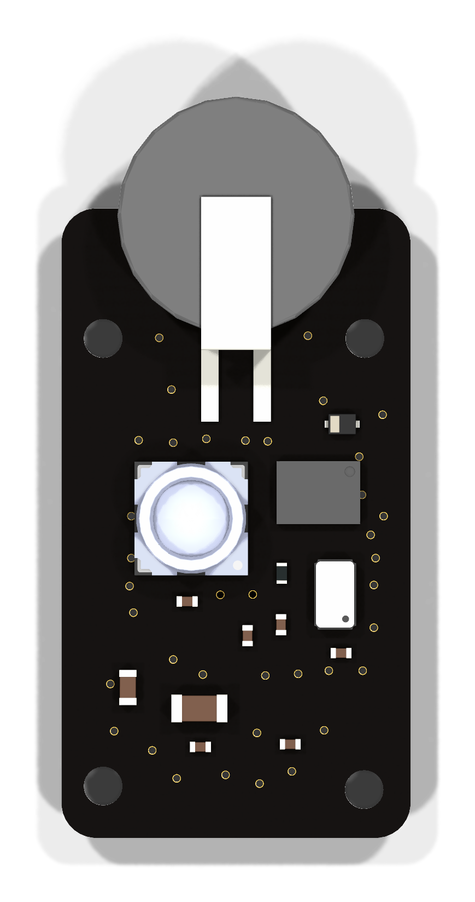
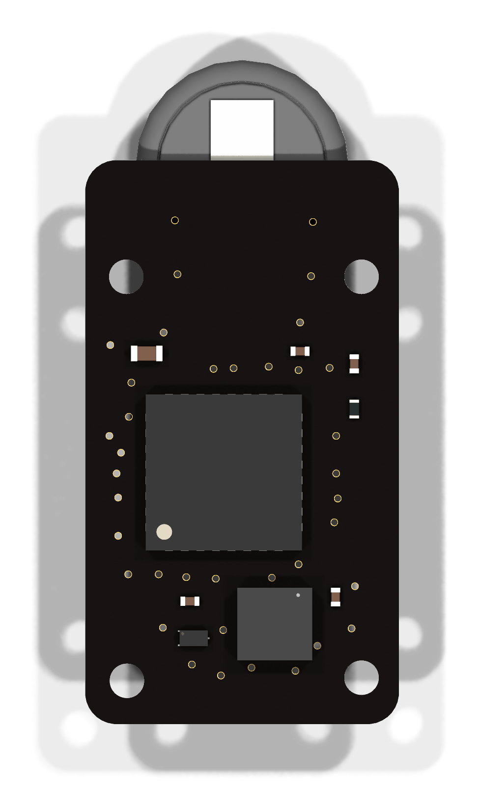
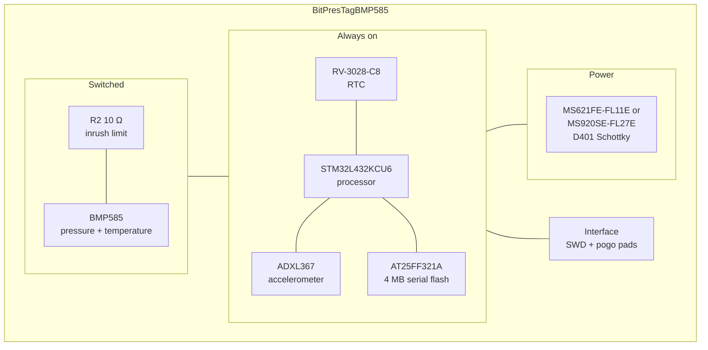

# UIUC Tag (BitPresTag)

The UIUC tag combines the two simplest sensing strategies in the family on one
board: a BitTag's activity accelerometer and a PresTag's pressure sensor. The
board documented here is **BitPresTagBMP585**, the revision using a Bosch BMP585
in place of the original ST pressure part.

## The board

<figure markdown>
  
  <figcaption>Top</figcaption>
</figure>

<figure markdown>
  
  <figcaption>Bottom</figcaption>
</figure>

The 10 ohm inrush resistor sits in series between the processor pin and the pressure sensor's supply. These are rendered from the KiCad layout by `kicad-cli`; see
[Board Designs](../boards/index.md) for how they are regenerated.

## Block diagram

## Major components

| Role | Part | Domain | Notes |
| --- | --- | --- | --- |
| Processor | STM32L432KCU6 | Always on | |
| RTC | RV-3028-C8 | Always on | 32.768 kHz, 1 ppm |
| Sensor | ADXL367BCCZ | Always on | 3-axis accelerometer |
| Sensor | BMP585 | **Switched** | Barometric pressure and temperature |
| Memory | AT25FF321A-UUN | Always on | 4 MB serial flash |
| Power | D401 CDBQC0130L-HF | — | Schottky reverse-polarity protection; no regulator |
| Battery | MS621FE-FL11E or MS920SE-FL27E | — | 5.5 mAh / 230 mg, or 11 mAh / 450 mg |

**The pressure sensor is powered from a processor pin, through a resistor.**
Pin `PB1` drives the net `LPS_PWR`, which passes through a 10 Ω series resistor
`R2` to `LPS_VDD` — the node that actually feeds the sensor's `VDD` and `VDDIO`
along with their decoupling capacitors.

That resistor is not incidental. The BMP585 datasheet specifies a minimum supply
ramp time of 10 µs and states normatively that supplies ramping faster than that
**must** have a 10 Ω series resistor, to avoid damage from repeated power
cycling. Repeated power cycling is precisely this tag's duty cycle. Before R2
was added, the only thing limiting inrush was the processor pin's own output
impedance, which cleared the requirement by somewhere between 1.1× and 2.2× —
and only on an inferred impedance and a firmware speed setting that could change.
With R2 the requirement is met by construction.

!!! note "Back-powering is a firmware contract"

    While `PB1` is low, the sensor's bus lines are still driven from the main
    domain. Firmware must not leave them high, or the sensor can be back-powered
    through its protection diodes.

One further quirk worth carrying into firmware: the ADXL367 on this board is
driven from USART2 in synchronous mode, not from an SPI peripheral.

## What it records

Activity and altitude together. The accelerometer produces the same one-bit
activity record a BitTag does, while the pressure sensor adds barometric
altitude on its own schedule. Having both on one tag means an active period can
be read alongside the altitude profile that accompanied it, rather than inferring
one from the other.

## Design files

[Design directory on GitHub](https://github.com/tag-designs/hardware/tree/main/BoardDesigns/Tags/BitPresTagBMP585){ .md-button }
[Schematic (PDF)](../schematics/BitPresTagBMP585.pdf){ .md-button }
[Design review](https://github.com/tag-designs/hardware/blob/main/BoardDesigns/Tags/BitPresTagBMP585/BitPresTagBMP585-design-review.md){ .md-button }

The review carries the full STM32L432 pin map, the supply headroom analysis at a
38 °C operating point, and ten findings with their resolutions. The original
revision, pairing an ADXL362 with an ST LPS27HHTW pressure sensor, is in the
repository under `BoardDesigns/Tags/BitPresTag`.
